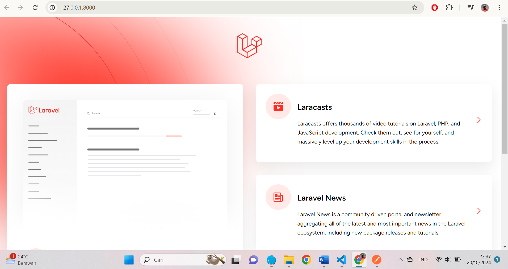
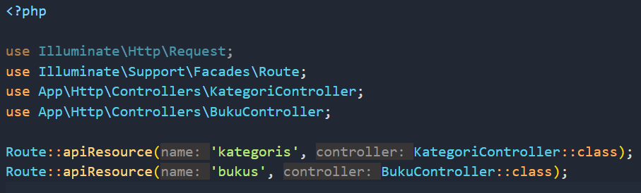
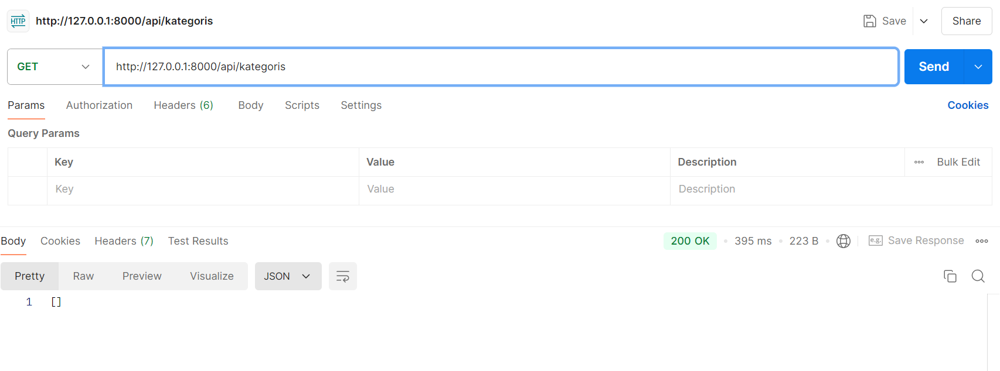
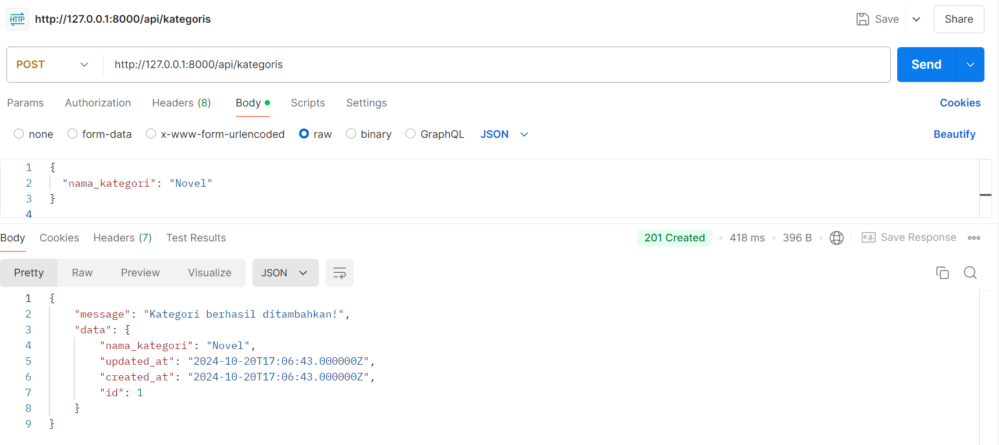
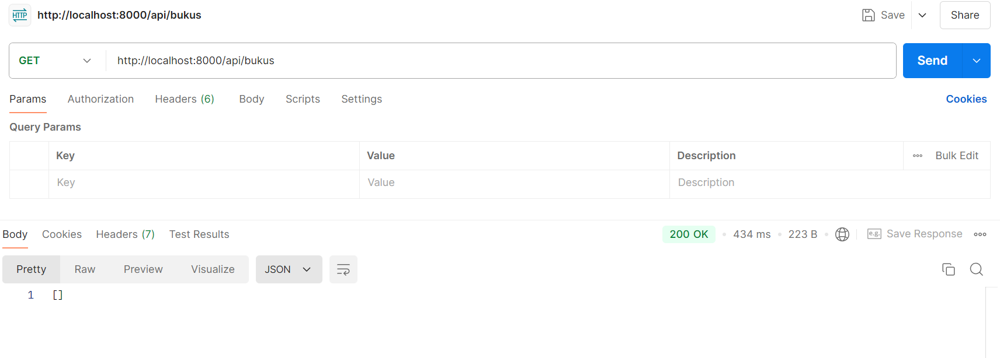
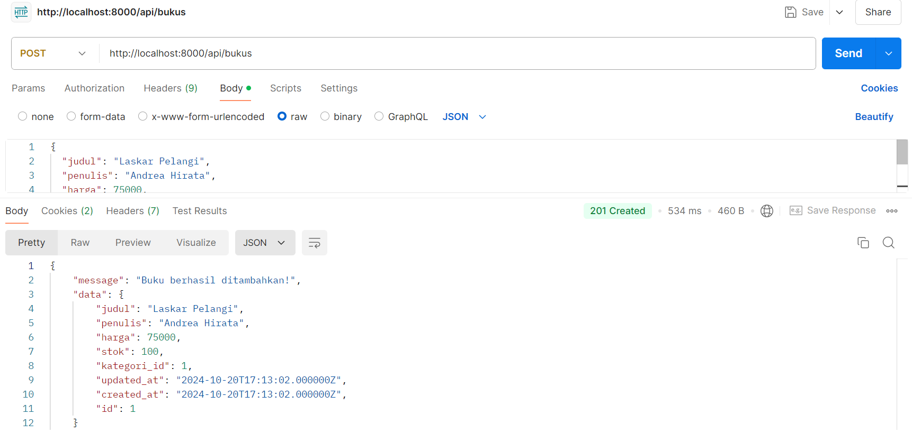
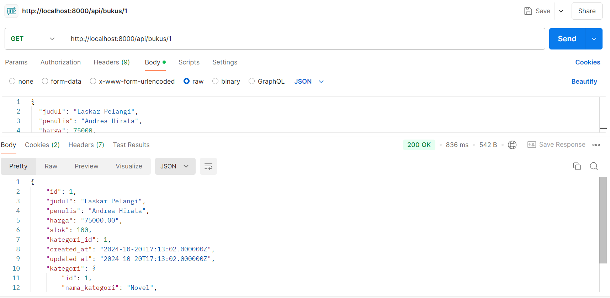
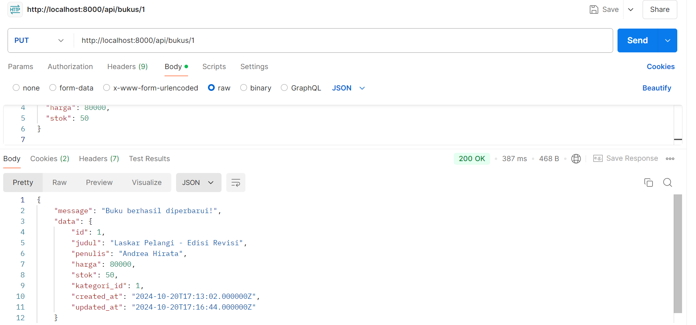
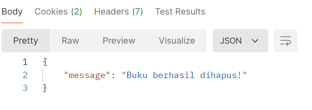

NAMA : MOH. ARBI ARDIANSYAH

NIM : 362358302150

KELAS : 2B TRPL

Praktikum Interoperabilitas: Membuat API Toko Buku dengan Laravel 11 dan Testing Menggunakan Postman

1.Saya sudah Menginstall PHP, Composer, dan MySQL.

  Dan saya buka http://localhost:8000 untuk memverifikasi instalasi berhasil.
  

2.Saya membuat API CRUD untuk Sistem Toko Buku

Membuat Migration dan Model

1. Kategori: Menambahkan dan menampilkan kategori buku.
2. Buku: Mengelola informasi buku (judul, penulis, harga, stok, dan kategori).

Kemudian saya membuat Controller API untuk Kategori dan Buku

Setelah itu saya Menambahkan Route API

3.Selanjutnya saya Testing API dengan Postman

GET Semua Kategori

POST Tambah Kategori Baru

GET Semua Buku

POST Tambah Buku Baru

GET Buku Berdasarkan ID

PUT Update Data Buku

DELETE Hapus Buku

